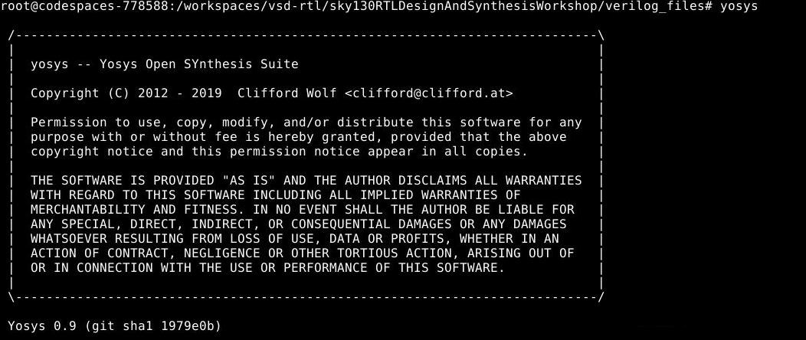
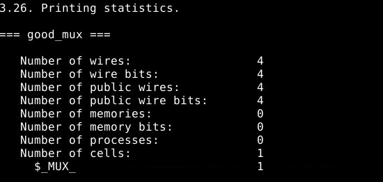
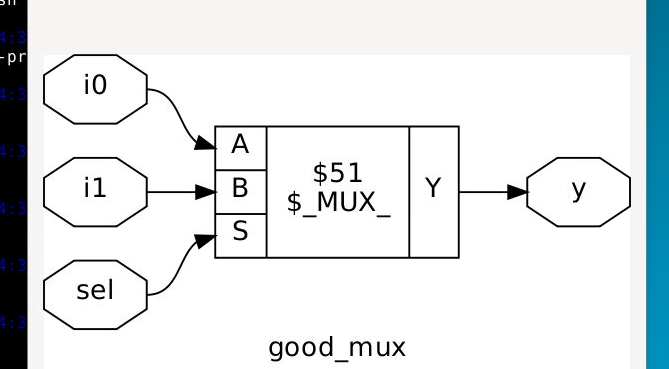

# rtlvlsiworkshop
# Day 1 – Verilog Simulation & Synthesis Flow

This README provides a clear, step-by-step guide to running Verilog simulations and synthesizing RTL designs using **Icarus Verilog**, **GTKWave**, and **Yosys**.

---

## 1. Icarus Verilog (Simulation)

Icarus Verilog is an open-source Verilog simulator used to compile RTL and testbench files, run simulations, and generate waveform outputs.

### 1.1 Compile RTL and Testbench

```bash
iverilog rtl_file.v tb_file.v
```

* **rtl_file.v** → RTL design file
* **tb_file.v** → Testbench applying stimulus and checking outputs

### 1.2 Run the Simulation

```bash
./a.out
```

* Executes RTL + testbench
* Generates a `.vcd` file if `$dumpfile` and `$dumpvars` are included
  


### 1.3 Generated VCD Waveform File

A Value Change Dump file is created:

```
tb_file.vcd
```

Use this file for waveform inspection.

---

## 2. GTKWave (Waveform Viewer)

GTKWave is used to view waveforms produced during simulation.

### 2.1 Open VCD File in GTKWave

```bash
gtkwave tb_file.vcd
```

You can add signals, zoom in/out, and analyze timing and logic behavior.

---


## 3. Yosys (Synthesis)

Yosys is an open-source Verilog synthesis suite used to optimize RTL and generate a gate-level netlist.

### 3.1 Start Yosys

```bash
yosys
```



### 3.2 Load RTL Design

```bash
read_verilog rtl_file.v
```

Loads all modules from your RTL file.

### 3.3 Load Standard Cell Liberty File

```bash
read_liberty -lib /path/to/libPDK_file.lib
```

Provides timing, cell definitions, and technology information.

### 3.4 Run Synthesis

```bash
synth -top rtl_file
```

* `rtl_file` is the top module name (not the filename)
  

### 3.5 Technology Mapping

```bash
abc -liberty /path/to/libPDK_file.lib
```

Maps the optimized netlist onto actual standard cells.

### 3.6 View Schematic

```bash
show
```

Displays the synthesized logic diagram.
 
### 3.7 Export Gate-Level Netlist

```bash
write_verilog -noattr rtl_file_netlist.v
```

Creates a clean Verilog netlist without tool-specific attributes.

---
 
## 4. Complete Flow Summary

1. Prepare RTL and testbench: `rtl_file.v`, `tb_file.v`
2. **Simulate** using Icarus Verilog:

   ```bash
   iverilog rtl_file.v tb_file.v
   ./a.out
   ```
3. **View Waveforms** in GTKWave:

   ```bash
   gtkwave tb_file.vcd
   ```
4. **Synthesize** with Yosys:

   ```bash
   yosys
   read_verilog rtl_file.v
   read_liberty -lib /path/to/libPDK_file.lib
   synth -top rtl_file
   abc -liberty /path/to/libPDK_file.lib
   show
   write_verilog -noattr rtl_file_netlist.v
   ```

---

Feel free to modify file names and library paths based on your project structure.
